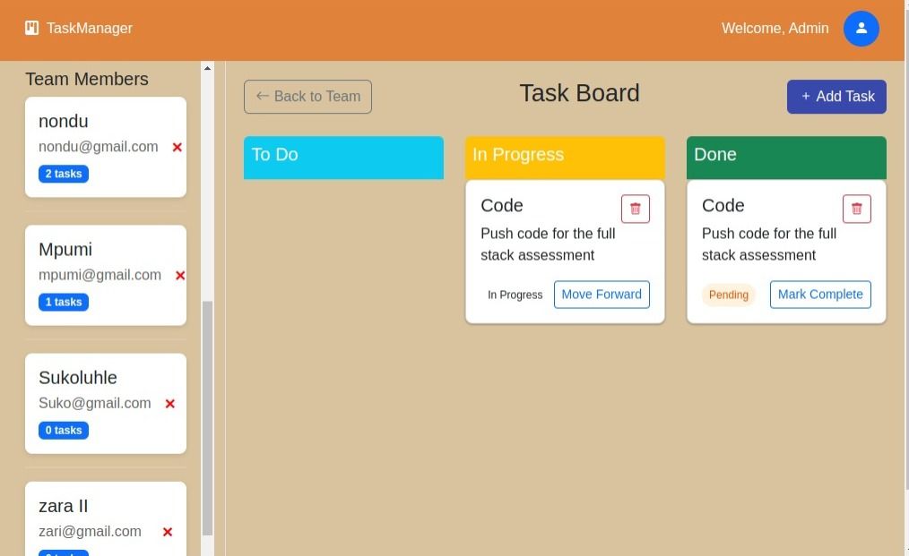
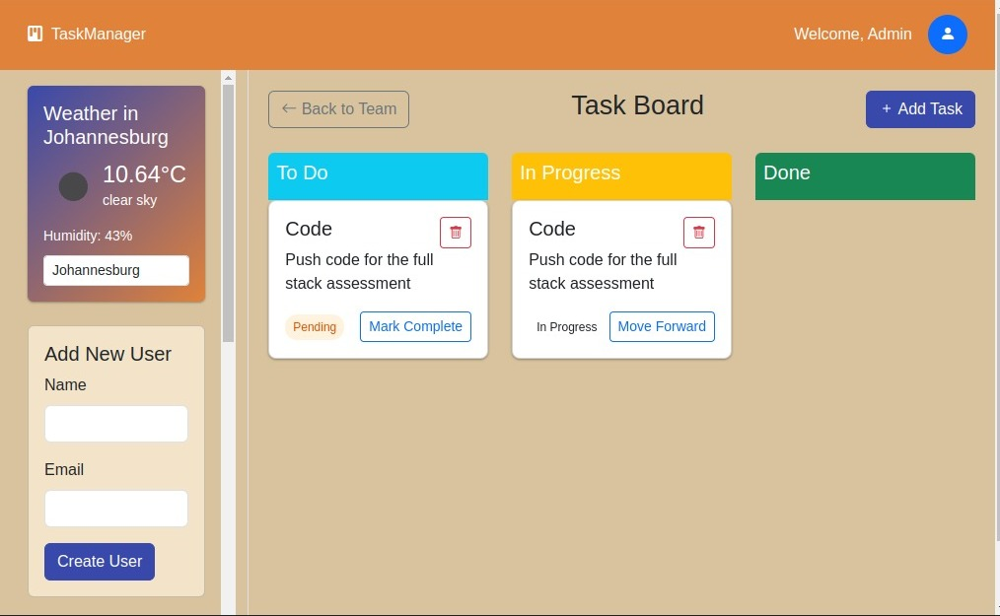

# User Task Manager

A full-stack application built with React, Node.js, Express, and TypeScript. It allows users to register and manage their personal task lists.

## 🌐 Live Demo

🔗 [Live Demo](https://user-task-manager-git-main-nondumisos-projects-b740904b.vercel.app/)

## Tech Stack

- Backend: Node.js, Express, TypeScript, SQLite (with TypeORM)
- Frontend: React (with Hooks), Bootstrap
- Database: SQLite
- Optional Extras: Docker, GitHub Actions, External APIs

## Features

- Create users
- View a list of users
- View tasks for a specific user
- Add tasks to a user
- Responsive UI with basic styling
- Weather info based on user's location

## Screenshots

###  User List


###  Task Manager


## Getting Started

### Clone the Repository

```bash
git clone https://github.com/your-username/user-task-manager.git
cd user-task-manager
```

### Backend

```bash
cd backend
npm install
npm run dev
```

## Environment Variables

Create a .env file in the frontend folder to store your API keys.
Example .env content
`REACT_APP_WEATHER_API_KEY=your_weather_api_key_here`
Replace your_weather_api_key_here with your actual API key.

`REACT_APP_API_BASE_URL=http://localhost:3001/api`

### Frontend

```bash
cd frontend
npm install
npm start
```

## Testing

Tests are written using:

- Jest for unit tests
- React Testing Library for UI component testing
- Supertest for backend integration tests

### Run tests

# Frontend

```bash
cd frontend
npm test
```

# Backend

```bash
cd backend
npm test
```

## Docker

This project uses Docker to containerize both backend and frontend services.

### Prerequisites

Make sure you have Docker and Docker Compose installed and running on your machine.

### Run with Docker Compose

From the root directory of the project `user-task-manager`, where `docker-compose.yml` is located, run:
`docker-compose up --build`

### Stop the Containers

To stop and remove the containers, networks, and volumes created by Docker Compose:
`docker-compose down`

## Author

Made with ❤️ by Nondumiso
